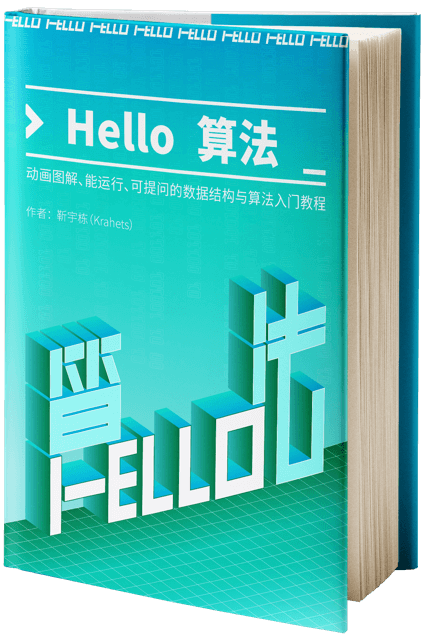
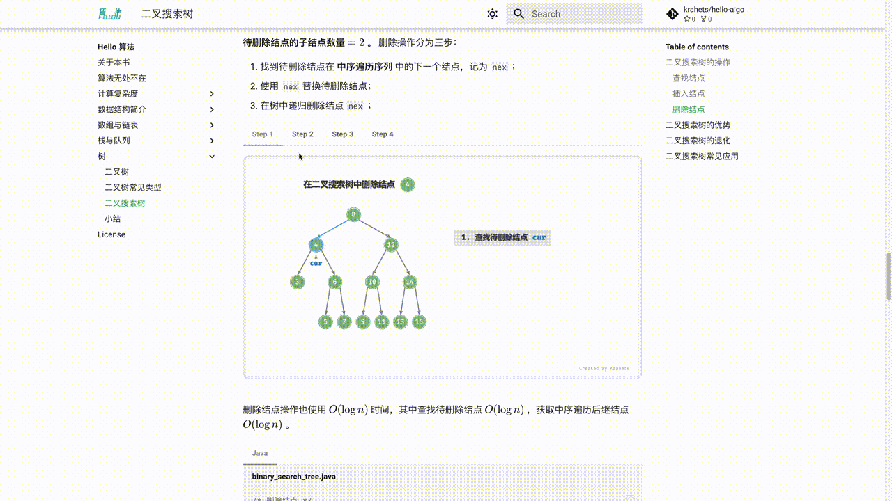
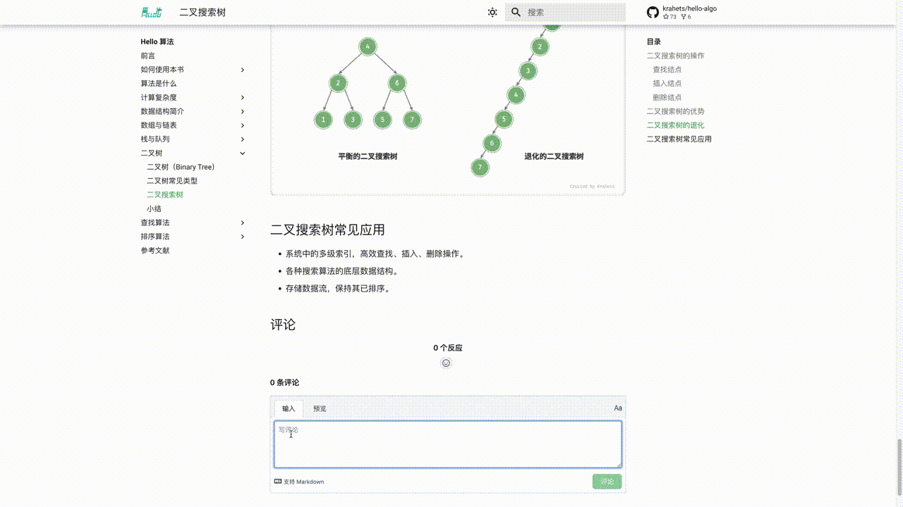

=== " "

    

    { align=left width=330 }
         
    <h1 align="center"> 《 Hello 算法 》 </h1>
    
 动画图解、能运行、可提问的 数据结构与算法快速入门教程 

    
 

    <h6 align="center"> [@Krahets](https://leetcode.cn/u/jyd/) </h6>
    

---

<h2 align="center"> 推荐语 </h2>

!!! quote

    “一本通俗易懂的数据结构与算法入门书，引导读者手脑并用地学习，强烈推荐算法初学者阅读。”

    **—— 邓俊辉，清华大学计算机系教授**

!!! quote

    “如果我当年学数据结构与算法的时候有《Hello 算法》，学起来应该会简单 10 倍！”

    **—— 李沐，亚马逊资深首席科学家**

---

<h3 align="center"> 「全书动画图解」 </h3>

 内容清晰易懂、学习曲线平滑 电脑、平板、手机全终端阅读 

!!! quote ""

    
 "A picture is worth a thousand words." 

    
 “一图胜千言” 

---

<h3 align="center"> 「代码一键运行」 </h3>

 提供各个算法与数据结构的简洁实现与测试样例，皆可直接运行 支持 Java, C++, Python, Go, JS, TS, C#, Swift, Zig 等语言 

!!! quote ""

    
 "Talk is cheap. Show me the code." 

    
 “少吹牛，看代码” 

---

<h3 align="center"> 「可讨论与提问」 </h3>

 鼓励小伙伴们互帮互助、共同成长 提问与评论一般能在两日内得到回复 

!!! quote ""

    
 “追风赶月莫停留，平芜尽处是春山” 

    
 一起加油！ 

---

<h2 align="center"> 序 </h2>

两年前，我在力扣上分享了《剑指 Offer》系列题解，受到了很多小伙伴的喜爱与支持。在此期间，我也回复了许多读者的评论问题，遇到最多的问题是“如何入门学习算法”。我渐渐也对这个问题好奇了起来。

两眼一抹黑地刷题应该是最受欢迎的方式，简单粗暴且有效。然而，刷题就如同玩“扫雷”游戏，自学能力强的同学能够顺利地将地雷逐个排掉，而基础不足的同学很可能被炸的满头是包，并在受挫中步步退缩。通读教材书籍也是常用方法，但对于面向求职的同学来说，毕业季、投递简历、应付笔面试已经占用大部分精力，厚重的书本也因此成为巨大的挑战。

如果你也有上述烦恼，那么很幸运这本书找到了你。本书是我对于该问题给出的答案，虽然不一定正确，但至少代表一次积极的尝试。这本书虽然不足以让你直接拿到 Offer ，但会引导你探索数据结构与算法的“知识地图”，带你了解不同“地雷”的形状大小和分布位置，让你掌握各种“排雷方法”。有了这些本领，相信你可以更加得心应手地刷题与阅读文献，逐步搭建起完整的知识体系。

<h3 align="left"> 作者简介 </h3>

靳宇栋 (Krahets)，大厂高级算法工程师，上海交通大学硕士。力扣（LeetCode）全网阅读量最高博主，其 LeetBook《图解算法数据结构》已被订阅 22 万本。

---

<h2 align="center"> 致谢 </h2>

本书在开源社区的群策群力下逐步成长，感谢每一位撰稿人，是他们的无私奉献让这本书变得更好，他们是（按照 GitHub 自动生成的顺序）：

    

本书的代码审阅工作由 justin‐tse, krahets, nuomi1, Reanon, sjinzh 完成，感谢他们的辛勤付出！

    <table>
        <tbody>
            <td align="center"><a href="https://github.com/justin-tse"> <b>justin-tse</b></a> JS / TS</td>
            <td align="center"><a href="https://github.com/krahets"> <b>krahets</b></a> Java / Python</td>
            <td align="center"><a href="https://github.com/nuomi1"> <b>nuomi1</b></a> Swift</td>
            <td align="center"><a href="https://github.com/Reanon"> <b>Reanon</b></a> Go / C</td>
            <td align="center"><a href="https://github.com/sjinzh"> <b>sjinzh</b></a> Rust / Zig</td>
        </tbody>
    </table>

---
